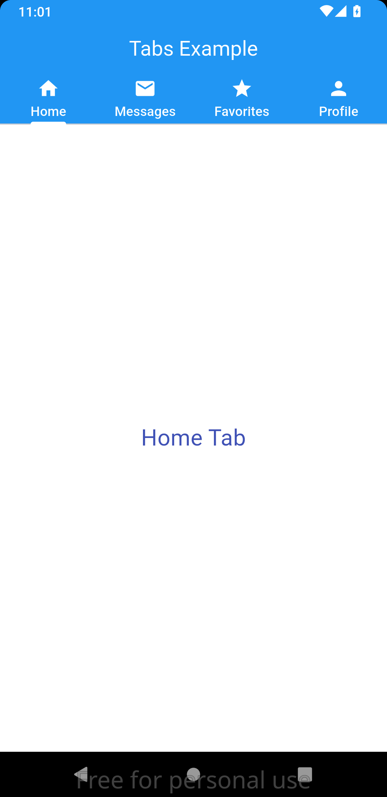

## flutter_tabs

Flutter project demonstrating the usage of TabBar and TabBarView in flutter.

### Screenshot

### Widgets Used

- **`TabBar`**: Displays tabs (In our case, they are Home, Messages, Favorites, Profile) with icons and labels. Some of it's attributes include:
    - `controller`: A `TabController` controller to coordinate tab selection.
    - `isScrollable`: Whether the tab bar can be scrolled horizontally.
    - `indicatorColor`: Color of the line that appears below the selected tab.
    - `tabs`: A list of two or more `Tab` widgets and the must match the controller's `length` attribute and the length of the TabBarView children list.
- **`TabBarView`**: Renders the content of the selected tab, supporting swipe gestures for navigation between tabs. Example attributes include:
    - `controller`: A `TabController` controller to coordinate tab selection.
    - `children`: A list of widgets whose length must match the controler's.
    - `dragStartBehavior`: Determines the way that drag start behavior is handled
- **`TabController`**: Manages tab state and synchronization between `TabBar` and `TabBarView` for smooth transitions. The controller takes the following attributes:
    - `length`: The total number of tabs
    - `vsync`: `TickerProvider` that manages the state required by TabBar and a TabBarView

### Prerequisites

Ensure [Flutter](https://flutter.dev/docs/get-started/install) v^3.29.3 is installed.

### Setup

1. Clone this repository: `git clone https://github.com/degide/flutter_tabs.git`.
2. Navigate to the project directory: `cd flutter_tabs`.
3. Run `flutter pub get` to install dependencies.
4. Start the app: `flutter run`.

### Contributor

- Egide Harerimana \<h.egide@alustudent.com\>

